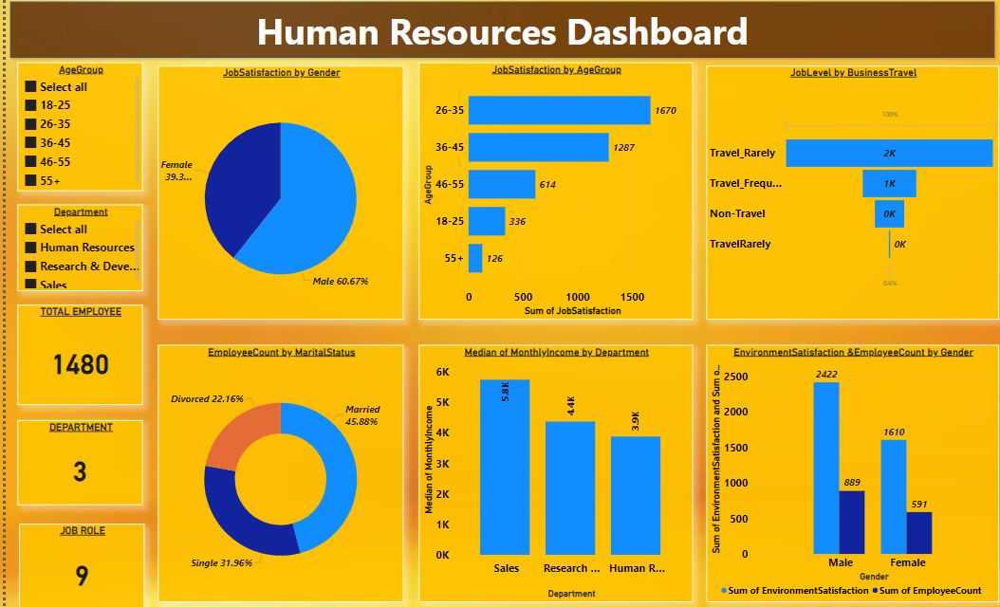

# **Employee Overview Dashboard**  

**Purpose:**  
The dashboard provides a detailed analysis of employee demographics, satisfaction levels, income distribution, and department-specific metrics. It offers actionable insights to HR teams for workforce management, performance tracking, and strategic planning.  

---

### **Key Metrics (Cards):**  
- **Total Employees:** A total workforce of 1,480 employees.  
- **Departments:** Employees are distributed across 3 departments (Research & Development, Sales, and Human Resources).  
- **Job Roles:** Covers 9 distinct roles, reflecting diverse job functions within the organization.  

---

### **Filters:**  
- **Age Group:** A DAX-calculated column categorizing employees into specific age groups for targeted analysis.  
- **Department:** Allows filtering of data for department-specific insights.  

---

### **Visualizations:**  

1. **Pie Chart:**  
   - **Job Satisfaction by Gender:**  
     - Male employees account for **60.67%** of job satisfaction ratings.  
     - The remaining satisfaction ratings belong to female employees.  

2. **Doughnut Chart:**  
   - **Employee Count by Marital Status:**  
     - **Divorced:** 22.16%  
     - **Married:** 45.88%  
     - **Single:** 31.96%  
   - Highlights the marital distribution, aiding in understanding workforce composition for engagement initiatives.  

3. **Stacked Column Charts:**  
   - **Monthly Income by Department:**  
     - Research & Development: **6,073K**  
     - Sales: **3,135K**  
     - Human Resources: **419K**  
   - Shows income disparities across departments, helping in budget allocation and pay equity analysis.  
   - **Employee Count by Gender:**  
     - Male: **889**  
     - Female: **591**  
   - Provides a gender-wise breakdown of the workforce to support diversity and inclusion strategies.  

---

### **Insights:**  
- **Job Satisfaction Trends:** Males dominate job satisfaction metrics, highlighting potential gender-specific engagement strategies.  
- **Income Distribution:** Research & Development generates the highest income, emphasizing its critical role in the organization.  
- **Workforce Composition:** Most employees are married, with a significant portion being single, offering insights into engagement and work-life balance needs.  
- **Diversity Analysis:** Male employees form a larger part of the workforce, indicating areas to focus on for gender diversity initiatives.  

